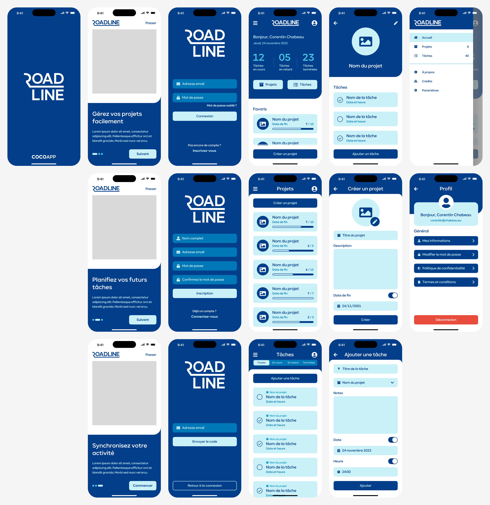

# Projet Flutter 2022 - RoadLine

__Bienvenue dans la documentation de RoadLine !__

Ce projet est réalisé dans le cadre du cours de **Développement d’applications mobiles** en Bloc 3 en Informatique de gestion à l'INPRES.

RoadLine est une application de gestion et d'aide à la réalisation de projet de vie.

## Présentation du projet

### Description de l'application

L'objectif de RoadLine est d'aider les utilisateurs à réaliser leurs projets de vie en découpant un projet sous forme de plusieurs sous-tâches. Un projet peut-être représenté comme une route composée de plusieurs étapes (sous-tâches) que l'utilisateur va devoir compléter afin de pouvoir atteindre l'objectif final du projet. La fin de la route correspond à l'aboutissement du projet. L'utilisateur doit être authentifié pour pouvoir utiliser l'application, ce qui lui permettra de synchroniser ses projets sur un serveur et de pouvoir les récupérer à tout moment.

Cette application n'est pas destinée à gérer les tâches quotidiennes et répétitives contrairement à d'autres applications déjà disponibles sur le marché.

Exemples de projet destinés à être géré par l'application :

- Achat d'une maison
- Passage du permis de conduire
- Création d'une petite entreprise

### Analyse du marché

- **Streaks** - Choses à faire bonne habitude

Streaks est une application d'aide à la réalisation des tâches quotidiennes. Cette application est destinée à être utilisée tous les jours par ses utilisateurs.

Exemples de projet destinés à être géré par l'application :

- Promener le chien
- Brossage des dents
- Manger sain

Siteweb : [https://streaks.app/](https://streaks.app/)

- **Things**

Things est une application de gestion de projets et de tâches. Son concept se rapproche beaucoup de l'application RoadLine à la différence que l'interface utilisateur n'a pas été pensée de la même manière. Cette application n'est disponible que sur des appareils de la marque Apple contrairement à l'application RoadLine qui prend en charge les appareils iOS et Android.

Siteweb : [https://culturedcode.com/things/](https://culturedcode.com/things/)

- **Monday.com**

Monday.com est une application de gestion de projet d'entreprise. Cette application est destinée à permettre la gestion de gros projets pour lesquels les tâches peuvent être réparties entre les différents membres du projet.

Siteweb : [https://monday.com/](https://monday.com/)

### User stories

- En tant qu'**utilisateur non connecté**, je veux pouvoir **me connecter** afin de **conserver mes projets et mes tâches**.
- En tant qu'**utilisateur connecté**, je veux pouvoir **créer un projet** afin de **gérer mes différentes tâches**.
- En tant qu'**utilisateur connecté**, je veux pouvoir **modifier un projet** afin de **mettre à jour les données**.
- En tant qu'**utilisateur connecté**, je veux pouvoir **supprimer un projet** afin de **nettoyer mes projets restants**.
- En tant qu'**utilisateur connecté**, je veux pouvoir **afficher mes projets** afin de **pouvoir les gérer**.
- En tant qu'**utilisateur connecté**, je veux pouvoir **ajouter un projet à mes favoris** afin d'y **accéder plus rapidement**.
- En tant qu'**utilisateur connecté**, je veux pouvoir **créer une tâche** afin d'**ajouter un nouvel objectif**.
- En tant qu'**utilisateur connecté**, je veux pouvoir **modifier une tâche** afin de **mettre à jour les données**.
- En tant qu'**utilisateur connecté**, je veux pouvoir **supprimer une tâche** afin d'**enlever un objectif**.
- En tant qu'**utilisateur connecté**, je veux pouvoir **afficher mes tâches** afin de **pouvoir les gérer**.
- En tant qu'**utilisateur connecté**, je veux pouvoir **terminer une tâche** afin d'**avancer dans l'évolution de mon projet**.

### Logos

### Moodboard

### Mock-up

### Démonstration

https://user-images.githubusercontent.com/114340642/213390181-b0d22f84-8cdd-4823-b5ce-36bb624b5115.mp4

## Consignes du projet

__[:page_facing_up: Énoncé du projet](ressources/enonce.pdf)__

## Organisation du projet

* __[:books: documentation/](documentation/)__

  Ressources utiles à l'installation, à la configuration et à l'utilisation du projet.

* __[:framed_picture: images/](images/)__

  Images présentent dans cette documentation.

* __[:volcano: ressources/](ressources/)__

  Ressources utiles au développement du projet.

* __[:rocket: roadline/](roadline/)__

  Dossier principal contenant le code source du projet.
